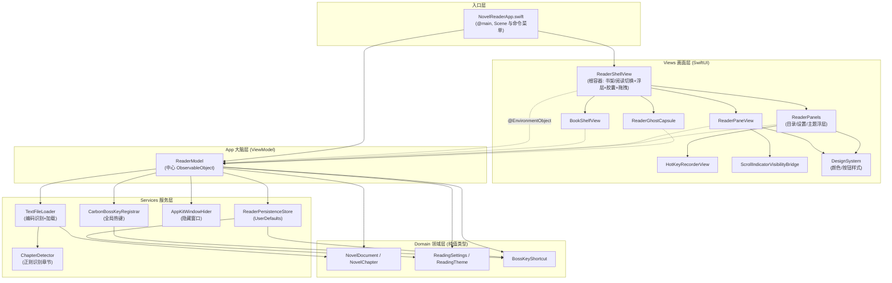
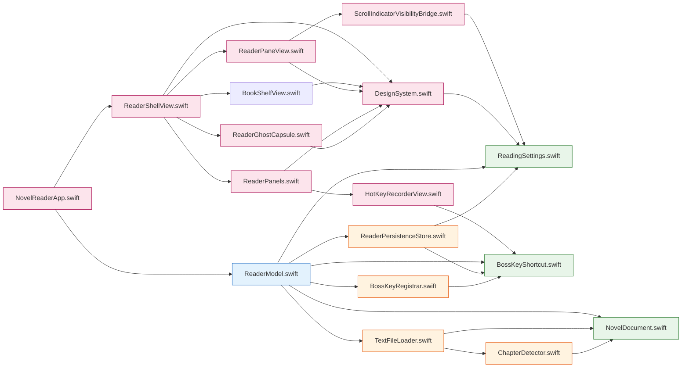
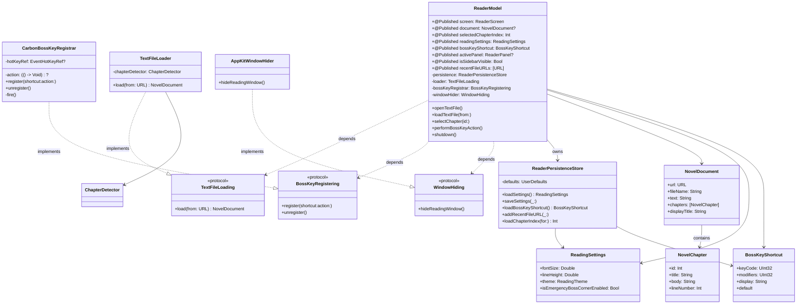
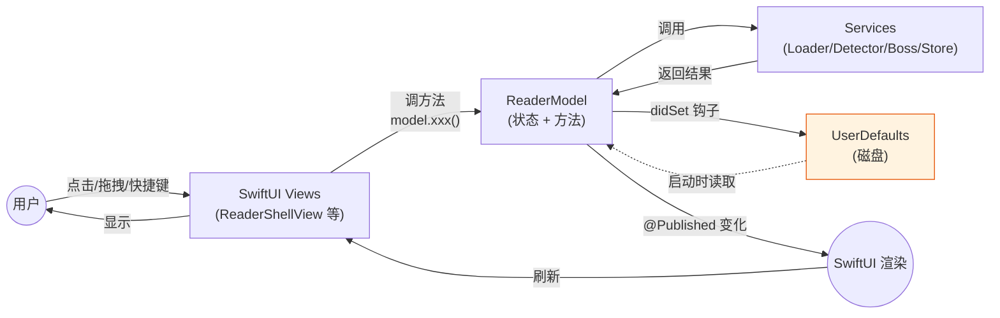
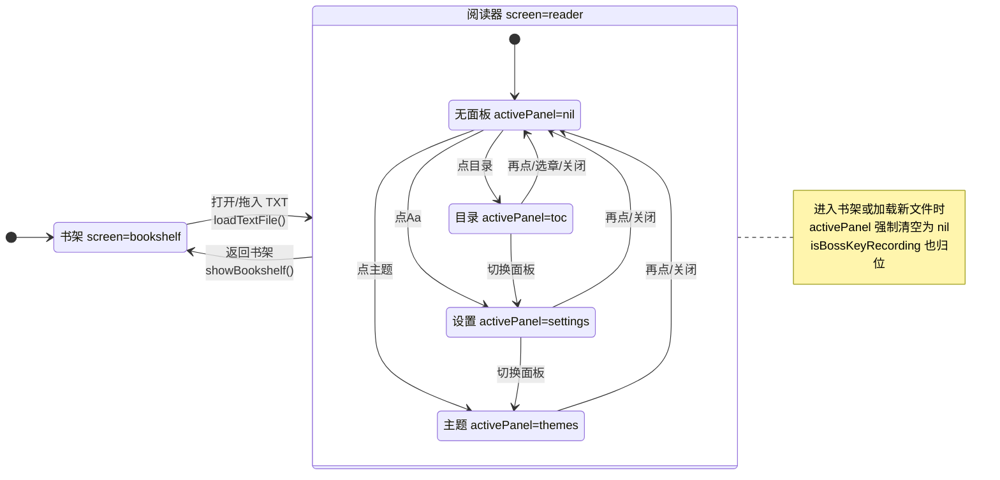
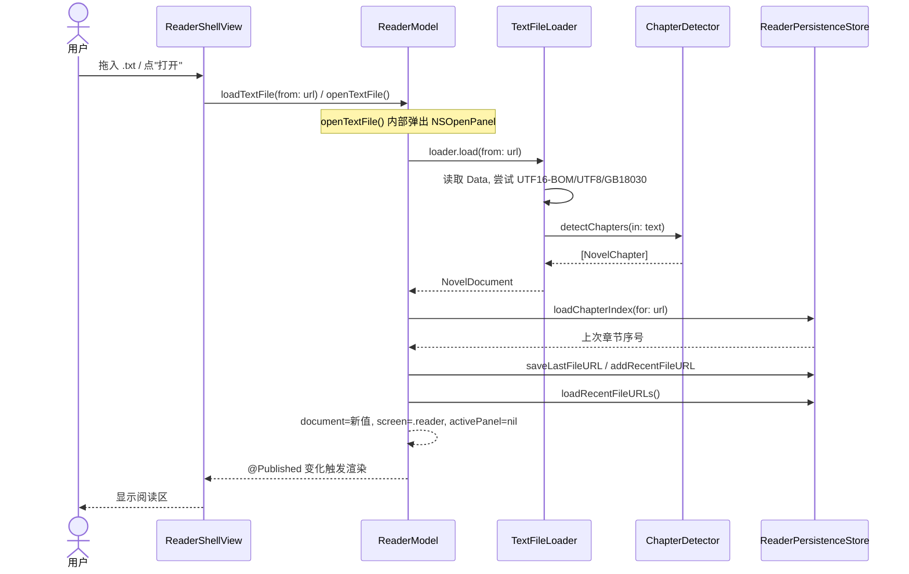
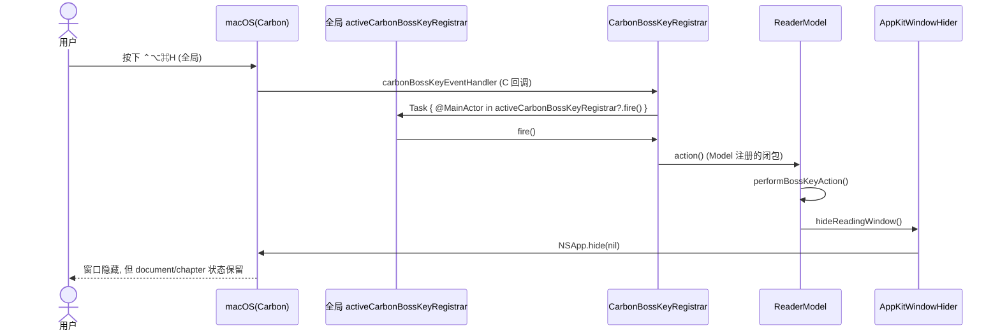
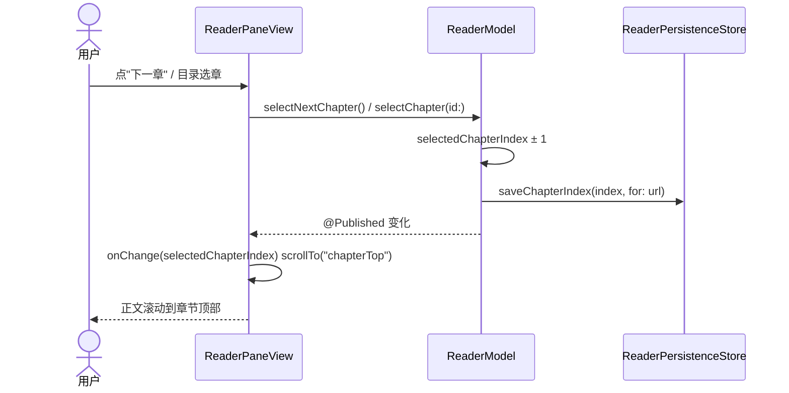
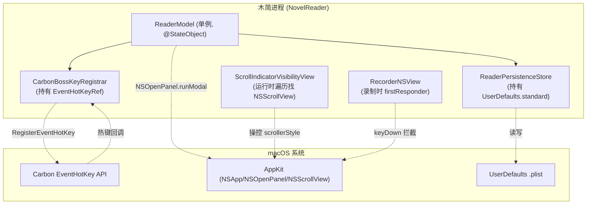

# 木简 架构文档

> 本文档基于对 `Sources/`、`Tests/`、`docs/adr/` 的完整阅读生成，旨在说清楚"木简"这个 macOS TXT 小说阅读器是怎么搭起来的，以及哪些地方还可以做得更好。
>
> 阅读建议：先看【一、项目概述】建立直觉，再按顺序看各架构图，最后看【九、优化建议】。

---

## 一、项目概述

**木简**是一个面向 macOS 14+ 的本地 TXT 小说阅读器，用 Swift 6 + SwiftUI 写成，单 target 可执行程序（`Package.swift` 中只有一个 `NovelReaderApp` executable target，无第三方依赖）。

它的核心使用场景是"摸鱼小窗阅读"：

- 打开本地 TXT，自动识别章节；
- 在小窗口里看正文、翻章节、调字号主题；
- "老板键"一键隐藏窗口（不退出、不清状态）；
- 书架记录最近打开过的书。

### 技术栈一览

| 维度 | 选型 |
|------|------|
| 语言 | Swift 6.0（启用 `@MainActor` 默认隔离） |
| UI | SwiftUI + 少量 AppKit 互操作（`NSViewRepresentable`、`NSOpenPanel`） |
| 全局热键 | Carbon `RegisterEventHotKey`（SwiftUI 没有原生全局热键 API） |
| 持久化 | `UserDefaults`，封装在 `ReaderPersistenceStore` |
| 测试 | Swift Testing（`import Testing` / `@Test` / `#expect`） |
| 构建 | Swift Package Manager（`Package.swift`） |

### 代码规模

约 15 个源文件、不到 1500 行 Swift 代码，是一个结构清晰的小型桌面应用。

---

## 二、分层架构图

木简采用经典的 **四层分层架构**，依赖方向永远是"上层依赖下层，下层不依赖上层"。Domain 层是最底层的"纯数据"，不依赖任何人；Views 依赖 App(Model) 与 Domain；App(Model) 依赖 Services 与 Domain。

> 用初中生能懂的话说：把代码分成四摞，最底下那摞是"书本/章节/设置"这些纯概念；往上一点的"服务摞"负责干活（读文件、识别章节、存设置、注册老板键）；再往上的"大脑摞"（ReaderModel）协调一切；最顶上的"画面摞"负责把东西画到屏幕上。下面的摞不知道上面的摞存在，这样才不会乱。

**关键约定**：Views 通过 `@EnvironmentObject` 拿到 `ReaderModel`，只读它的 `@Published` 属性、调它的方法，绝不自己直接碰 Services。所有副作用都收敛到 Model 里。

---

## 三、模块依赖图

这张图聚焦"谁 import 谁 / 谁引用谁的具体类型"，可以看出 Domain 是零依赖的叶子，`ReaderModel` 是被引用最多的中心节点。

**读图结论**：依赖关系是干净的"树"，没有循环依赖；`Domain` 三个文件互相独立；唯一略"重"的节点是 `ReaderModel`，它同时持有 4 个服务并暴露 17 个 `@Published` 状态（这一点后面会讨论）。

---

## 四、组件关系图（类与协议）

这张图用 UML 类图视角，展示核心类型、协议与实现之间的继承/实现/依赖关系。重点是 **协议抽象** 让 `ReaderModel` 可以在测试里被换成 Fake。

> 用初中生能懂的话说：Model 不会"死绑"某一个具体干活的工具，而是面向"接口"要人。比如它要的是"能注册老板键的东西"（协议 `BossKeyRegistering`），真正干活的是 `CarbonBossKeyRegistrar`，但在测试时可以塞一个"假的"进去，这样测试就不用真的去注册系统热键。

**测试可替换性**：`ReaderModelTests` 正是利用这三个协议，注入 `FakeBossKeyRegistrar`、`FakeWindowHider` 来验证老板键冲突、隐藏等行为，而无需触碰真实 Carbon API。这是整个架构最值得肯定的设计。

---

## 五、数据流图

木简是一个典型的 **单向数据流（unidirectional data flow）** 应用：用户操作 → View 调 Model 方法 → Model 调 Service 并更新 `@Published` → SwiftUI 自动重新渲染。持久化通过 `didSet` 钩子在状态变化时同步写入 `UserDefaults`。

**两个关键细节**：

1. **持久化是"写入即落盘"**：`readingSettings`、`bossKeyShortcut`、`isSidebarVisible` 三个属性都挂了 `didSet`，每次改值都会立刻 `persistence.saveXxx()`。好处是简单不丢数据，代价是频繁小写入（后面优化建议会提）。
2. **启动恢复**：`ReaderModel.init` 里一次性从 `persistence` 读回侧栏状态、设置、老板键、最近文件，但**不**自动恢复上次打开的书（刻意回到书架，符合 ADR-0001"小窗优先、入口克制"的取向）。

---

## 六、状态机图

木简的界面由两个正交的状态轴驱动：**屏幕轴**（书架 / 阅读器）和**面板轴**（无 / 目录 / 设置 / 主题）。下图展示它们的合法迁移。

**隐藏的第三轴**：`isBossKeyRecording`（是否正在录制新老板键）是一个布尔状态，它和面板状态联动——打开任意面板、关闭面板、回到书架、加载新文件时都会被强制设为 `false`。这个"到处归位"的逻辑分散在 6 个方法里，是潜在的不一致来源（见优化建议）。

---

## 七、关键流程时序图

### 7.1 打开 TXT 文件

### 7.2 老板键隐藏窗口（全局热键路径）

> 这条链路最特殊：触发源不是 SwiftUI，而是 Carbon 系统事件回调，靠一个**全局 weak 变量**把回调转发回 Model。

**注意**：还有一条"应急老板角"路径（`EmergencyBossCorner`），鼠标悬停右上角 110ms 后直接调 `performBossKeyAction()`，不经过 Carbon。两条路径最终都汇到 `windowHider.hideReadingWindow()`。

### 7.3 切换章节并持久化

---

## 八、运行时组件图

下图展示应用跑起来后，进程内有哪些活跃对象，以及它们如何与 macOS 系统服务交互。

---

## 九、架构决策演进（ADR 摘要）

`docs/adr/` 记录了 6 条决策，呈现了一条清晰的"收束"轨迹：

**最终落地的形态**（ADR-0004/0005）：放弃了"悬停自动显隐"和"目录浮层"，改为 **右上角幽灵胶囊**（`ReaderGhostCapsule`，悬停才浮现按钮）+ **浮层面板**（`ReaderFloatingPanel`，点胶囊按钮弹出）。这与 ADR-0003"悬停显现"在精神上保留了一部分（幽灵胶囊仍靠 hover 显现），但把"侧栏"概念收敛成了"浮层"，更克制。当前代码里 `isSidebarVisible` 这个名字其实有点名不副实——它并不控制一个常驻侧栏，而是被 `ReaderShellView` 用来决定一些 padding（实际阅读视图并未真正消费它来显示/隐藏侧栏），这是演进留下的痕迹。

---

## 十、值得优化的地方

下面按"影响面 × 严重度"排序，分三档给出。每条都给出**问题定位**、**为什么是问题**、**建议方向**。

### 🔴 高优先级

#### 1. 大文件加载会卡住主线程

- **位置**：[TextFileLoader.swift](file:///Users/Alex/AI/project/novel/Sources/NovelReaderApp/Services/TextFileLoader.swift) `load(from:)` + [ChapterDetector.swift](file:///Users/Alex/AI/project/novel/Sources/NovelReaderApp/Services/ChapterDetector.swift) `detectChapters(in:)`
- **问题**：`Data(contentsOf:)` 同步读盘，`detectChapters` 同步对整篇文本逐行做 4 条正则匹配。`ReaderModel` 是 `@MainActor`，`loadTextFile` 在主线程执行。打开一个几十 MB 的 TXT 时，UI 会冻住。
- **建议**：把"读盘 + 解码 + 识别章节"放到后台 Task，主线程只接收最终的 `NovelDocument`。可以用 `Task.detached` 或让 `TextFileLoading` 协议方法变成 `async`。

#### 2. ReaderModel 是一个"上帝对象"

- **位置**：[ReaderModel.swift](file:///Users/Alex/AI/project/novel/Sources/NovelReaderApp/App/ReaderModel.swift)
- **问题**：它同时管屏幕导航、文档加载、章节翻页、阅读设置、老板键注册/录制、侧栏开关、面板开关、最近文件、持久化协调——17 个 `@Published`、30+ 个方法。任何需求改动几乎都要改它。
- **建议**：按职责拆分。例如把老板键相关（`bossKeyShortcut`、`isBossKeyRecording`、`bossKeyMessage`、注册/录制逻辑）抽成独立的 `BossKeyModel`；把阅读设置抽成 `SettingsModel`。`ReaderModel` 只持有这几个子模型并做顶层协调。这样每个子模型都能独立测试。

#### 3. Model 直接弹 NSOpenPanel，UI 逻辑混进业务层

- **位置**：[ReaderModel.swift](file:///Users/Alex/AI/project/novel/Sources/NovelReaderApp/App/ReaderModel.swift) `openTextFile()` 内 `let panel = NSOpenPanel(); panel.runModal()`
- **问题**：`ReaderModel` 是纯逻辑大脑，却直接创建并运行模态文件选择面板。这让 Model 无法在无 GUI 环境测试，也违反了分层（Model 不该知道 AppKit 的窗体控件）。
- **建议**：把"选文件"这一步交给 View 层（用一个 `FileOpener` 协议或直接在 View 的 Button action 里弹面板），Model 只保留 `loadTextFile(from: URL)` 这个纯输入接口。

#### 4. Carbon 老板键依赖全局可变变量

- **位置**：[BossKeyRegistrar.swift](file:///Users/Alex/AI/project/novel/Sources/NovelReaderApp/Services/BossKeyRegistrar.swift) `private weak var activeCarbonBossKeyRegistrar`
- **问题**：Carbon 的 `EventHandlerUPP` 是 C 函数指针，无法捕获 `self`，所以用一个**全局 weak 变量**做中转。这意味着全局只能有一个 `CarbonBossKeyRegistrar`，第二个会覆盖第一个；也让这个类的"单一实例"约束是隐式的、未在类型层面表达。
- **建议**：把 registrar 做成显式单例（`static let shared`，`init` 私有化），让"全局唯一"从隐式约定变成类型保证；或者在文档/注释里明确标注这一约束。当前代码已有 `activeCarbonBossKeyRegistrar = self` 在 `init` 里赋值，但没有任何防护防止重复构造。

### 🟡 中优先级

#### 5. ChapterDetector 每次调用都重建正则字符串

- **位置**：[ChapterDetector.swift](file:///Users/Alex/AI/project/novel/Sources/NovelReaderApp/Services/ChapterDetector.swift) `isChapterTitle(_:)` 及 4 个 `var xxxPattern: String`
- **问题**：4 个 pattern 是计算属性，每次访问都生成新 `String`；`range(of:options: .regularExpression)` 每次都会重新编译正则。对万行文本要调用上万次，编译开销可观。
- **建议**：把 4 条正则预编译为 `static let` 的 `NSRegularExpression`，用 `regex.firstMatch(in:options:range:)` 替代 `String.range(of:options:)`。

#### 6. NovelDocument.text 是冗余字段，白白占内存

- **位置**：[NovelDocument.swift](file:///Users/Alex/AI/project/novel/Sources/NovelReaderApp/Domain/NovelDocument.swift) `let text: String`
- **问题**：全代码搜索 `.text` 字段访问，唯一匹配是 SF Symbol 名 `"doc.text"`，**没有任何地方读取 `document.text`**。正文全部从 `chapters[].body` 取。也就是说完整文本在内存里存了两份（一份 `text`，一份拆进各章 `body`）。对大文件是实打实的内存浪费。
- **建议**：删除 `NovelDocument.text`，或保留 `text` 但让 `chapters` 用 `(range: Range<String.Index>)` 引用原文本而非复制 `body`——后者还能顺带解决"大文件章节体也占双倍内存"的问题。

#### 7. 书架最近文件不校验存在性

- **位置**：[ReaderPersistenceStore.swift](file:///Users/Alex/AI/project/novel/Sources/NovelReaderApp/Services/ReaderPersistenceStore.swift) `loadRecentFileURLs()` / [BookShelfView.swift](file:///Users/Alex/AI/project/novel/Sources/NovelReaderApp/Views/BookShelfView.swift)
- **问题**：`recentFileURLs` 只存路径字符串。文件被删除/移动后，书架仍显示卡片，点击才在 `loadTextFile` 里报错。
- **建议**：加载最近文件时用 `FileManager.fileExists` 过滤，或在卡片上标灰禁用；打开失败时自动从最近列表移除该条。

#### 8. 章节内滚动位置不持久化

- **位置**：[ReaderModel.swift](file:///Users/Alex/AI/project/novel/Sources/NovelReaderApp/App/ReaderModel.swift) `saveCurrentChapterIndex()` / [ReaderPaneView.swift](file:///Users/Alex/AI/project/novel/Sources/NovelReaderApp/Views/ReaderPaneView.swift)
- **问题**：只存了"第几章"，没存"章内滚到哪"。返回上一章时 `scrollTo("chapterTop")` 永远回到章节顶部，长章节体验不佳。
- **建议**：把 `scrollOffset` 也按 `(url, chapterIndex)` 存进 `UserDefaults`，切回时恢复。

#### 9. isBossKeyRecording 状态归位逻辑分散

- **位置**：`ReaderModel` 的 `togglePanel`、`closePanel`、`showBookshelf`、`loadTextFile`、`startBossKeyRecording`、`updateBossKeyShortcut` 都在手动设 `isBossKeyRecording = false`
- **问题**：同一个"退出录制"语义散落在 6 处，新增任何会打断录制的入口都容易漏掉一处，导致"录制中"状态卡死。
- **建议**：抽一个 `exitBossKeyRecording()` 私有方法统一调用；或把"录制态"与"面板态"绑定成一个枚举（如 `activePanel` 增加一个 `.bossKeyRecording` 概念），让状态机本身保证互斥。

### 🟢 低优先级 / 整洁度

#### 10. 颜色系统有"动态色"和"主题色"两套，容易用错

- **位置**：[DesignSystem.swift](file:///Users/Alex/AI/project/novel/Sources/NovelReaderApp/Views/DesignSystem.swift)
- **问题**：`Color.readerPaper`（静态，跟随系统深浅色）和 `Color.readerPaper(for:)`（按阅读主题）是两套并行体系。`BookShelfView` 用的是 `Color.readerPaper`（不带主题），而阅读区用的是 `readerPaper(for: theme)`。书架不响应"夜读"主题，是个不一致。
- **建议**：统一成一套。要么书架也走 `readerPaper(for: theme)`，要么彻底放弃 `for:` 重载改用环境色。

#### 11. BossKeyShortcut.display 是手工拼接的存储字段

- **位置**：[BossKeyShortcut.swift](file:///Users/Alex/AI/project/novel/Sources/NovelReaderApp/Domain/BossKeyShortcut.swift) + [HotKeyRecorderView.swift](file:///Users/Alex/AI/project/novel/Sources/NovelReaderApp/Views/HotKeyRecorderView.swift)
- **问题**：`display` 字符串在录制时由 `NSEvent.modifierFlags.displayPrefix + keyDisplay` 拼出来，存进 `UserDefaults`。`keyCode/modifiers/display` 三者可能不一致（比如手动改了 defaults）。
- **建议**：让 `display` 成为计算属性，由 `keyCode + modifiers` 推导（用 `UCKeyTranslate` 把 keyCode 转字符），消除"存储与计算"两份真相。

#### 12. isSidebarVisible 名实不符

- **位置**：[ReaderModel.swift](file:///Users/Alex/AI/project/novel/Sources/NovelReaderApp/App/ReaderModel.swift)
- **问题**：字段名叫"侧栏可见"，但当前 UI 里没有一个真正的常驻侧栏（侧栏概念已被 ADR-0004 的浮层取代）。全代码搜索确认：`isSidebarVisible` 只在 `ReaderModel`（定义/持久化）和 `ReaderPersistenceStore`（存取）中出现，**没有任何 View 读取它，也没有任何控件调用 `toggleSidebar()`**——它是一个被持久化但从未被消费的"死状态"。这是架构演进遗留的命名与逻辑债。
- **建议**：要么移除该状态及其持久化，要么重命名为它实际控制的语义（如 `compactMode`），并补上对应的 UI 行为。

#### 13. ScrollIndicatorVisibilityBridge 用重试+遍历找 NSScrollView，较脆弱

- **位置**：[ScrollIndicatorVisibilityBridge.swift](file:///Users/Alex/AI/project/novel/Sources/NovelReaderApp/Views/ScrollIndicatorVisibilityBridge.swift)
- **问题**：为了控制 SwiftUI `ScrollView` 的滚动条显隐，用一个 `NSViewRepresentable` 反向遍历视图树找 `NSScrollView`，还带了"最多重试 8 次"的轮询。这是绕过 SwiftUI 限制的 hack，在系统升级或视图层级变化时可能失效。
- **建议**：macOS 14+ 可考虑用 `.scrollIndicators` 修饰符直接控制（`ReaderPaneView` 其实已经用了 `.scrollIndicators(isScrollHovered ? .visible : .hidden)`），评估是否可以删掉这个 Bridge，减少自定义 AppKit 互操作面。

---

## 十一、总结

木简是一个**架构清晰、规模克制**的小型 macOS 应用，做得好的地方：

- ✅ 四层分层干净，Domain 零依赖，无循环引用；
- ✅ 服务层用协议抽象（`TextFileLoading`/`BossKeyRegistering`/`WindowHiding`），可测试性好，测试用 Fake 注入到位；
- ✅ 单向数据流 + `@Published`，状态变化可追踪；
- ✅ ADR 记录了设计演进，决策有迹可循。

主要改进方向集中在三处：

1. **性能**：大文件加载/识别要走后台线程，正则要预编译，`NovelDocument.text` 冗余内存要清掉；
2. **职责切分**：`ReaderModel` 过重需要拆分，`NSOpenPanel` 要移出 Model，老板键录制态要收敛；
3. **一致性**：颜色系统、`isSidebarVisible` 命名、最近文件校验等历史遗留需要清理。

整体而言，这是一个"小而美、可读性高"的代码库，当前的优化点都属于"锦上添花"而非"伤筋动骨"，重构风险可控。
